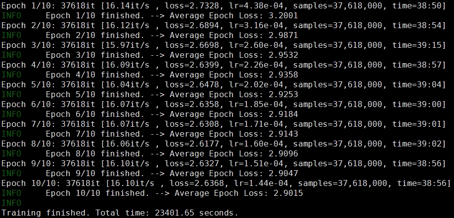

# English-to-Chinese Neural Machine Translation

This repository provides a step-by-step example of a complete NMT workflow, from data collection and cleaning to model training and interactive translation.
- setup nmt venv, install requirements
- `source your_venv/bin/activate`
- cd step_01_scripts
    - `./ch01_download.py`, decompressed and put into `../data/raw/decompressed`
    - `./ch02_stats.py --en ../data/raw/decompressed/object.pouta.csc.fi-Tatoeba-Challenge.eng-zho/train.src --zh ../data/raw/decompressed/object.pouta.csc.fi-Tatoeba-Challenge.eng-zho/train.trg --out-prefix ../data/cleaned/object.pouta.csc.fi-Tatoeba-Challenge.eng-zho --plot all`, and do the same plots for other corpus
    - `./ch03_clean.py --en ../data/raw/decompressed/object.pouta.csc.fi-Tatoeba-Challenge.eng-zho/train.src --zh../data/raw/decompressed/object.pouta.csc.fi-Tatoeba-Challenge.eng-zho/train.trg --min-len=3 --max-len=100 --ratio=5.5 --out-prefix ../data/cleaned/txt/Tatoeba-Challenge.eng-zho --t2s`, the parameters bases on the data shape from plots, `--t2s` required if original data is tranditional Chinese. Do similar for other corpus.
- cd step_02_preprocess
    - `./ch01_train_spm.py --input ../data/cleaned/txt/ --vocab_size=16000`, trains a SentencePiece model on the combined English and Chinese corpora. This process generates two files in `../data/spm_model`: `spm_bilingual.model` and `spm_bilingual.vocab`
        - `spm_bilingual.model` tokenizer in protobuf, used in transformer
        - `spm_bilingual.vocab` human readable for .model for review only, with a log-likelihood score, bigger means more frequent.
    - `./ch02_apply_spm_tokenizer.py --model ../data/spm_model/spm_bilingual.model --input ../data/cleaned/txt --output ../data/bin/ --batch_size 100`
    - `./ch03_analyze_spm_vocab.py --model ../data/spm_model/spm_bilingual.model  --corpus ../data/cleaned/txt/`, apply this spm model to a corpus folder, from the output to see how good it is. example output:
    <details>
    <summary>Click to view example output</summary>
    ```
        🧮 Total tokens: 719,113,284
        📊 Token coverage:
        - Unique tokens seen in corpus: 15,996 / 16,000
        - Ratio of low-frequency tokens (< 5 occurrences): 0.03%
        - Unused tokens in vocabulary: 4
        📏 Average sentence length (in 'words'): 10.23 (Note: ZH counts chars, EN counts space-split words)
        📏 Average sentence length (in tokens): 9.56
        ⚙️  Granularity (tokens/'word'): 0.93

        🔥 Top 50 most frequent tokens:
        .          28360242
        ▁          22861442
        ,          19585318
        s          11549333
        ▁the       9558514
        ...
        📈 Corpus Coverage by Top Tokens:
        - Top 1,000 tokens cover 62.66% of the corpus
        - Top 5,000 tokens cover 85.62% of the corpus
        - Top 10,000 tokens cover 95.48% of the corpus
    ```
    </details>
- cd project_root
    - `python3 -m nmt.step_03_transformer.ch02_train_transformer` or `python3 -m nmt.step_03_transformer.ch02_train_transformer --resumed-model=transformer_nmt.pth`, example output:
    
    - `python -m nmt.step_03_transformer.ch04_interactive_translate --model-path=<your_model_name>.pth`,to do the translation, example output:    
    
